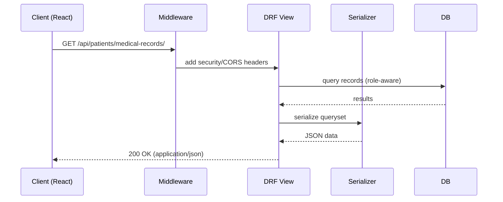

# USC‑PIS Architecture Overview

## System Layout

- Backend: Django 5 + Django REST Framework in `backend/`
- Frontend: React (Vite) in `backend/frontend/frontend/` served by WhiteNoise in production
- Database: PostgreSQL (prod) / SQLite (dev)
- Storage: Local filesystem by default; optional Cloudinary when `USE_CLOUDINARY=True`
- Email: SMTP fallback or AWS SES when `USE_AWS_SES=True`

## Django Apps (Modules)

- `authentication`: Users, roles, login/register, password flows, profile setup
- `patients`: Patient profiles, medical records, dental records, consultations
- `health_info`: Health information pages, campaigns, campaign resources, campaign feedback
- `feedback`: General and visit‑linked feedback from patients
- `file_uploads`: Secure file upload API with validation
- `medical_certificates`: Certificate workflow (templates, approvals, PDFs)
- `notifications`: In‑app/email notifications, templates, logs, preferences
- `reports`: Report templates, background generation, downloads, analytics
- `utils`: System health, database metrics, backup engine (create/verify/restore), email admin APIs

## API Mount Points

- `/api/auth/` → `authentication.urls`
- `/api/patients/` → `patients.urls`
- `/api/health-info/` → `health_info.urls`
- `/api/feedback/` → `feedback.urls`
- `/api/files/` → `file_uploads.urls`
- `/api/medical-certificates/` → `medical_certificates.urls`
- `/api/notifications/` → `notifications.urls`
- `/api/reports/` → `reports.urls`
- `/api/utils/` and `/api/system/` → `utils.urls`

## Request Flow (High Level)

1. Client sends requests to `/api/...` endpoints
2. Middleware applied (security headers, CORS, API response/versioning, request logging, health checks)
3. DRF viewsets/views handle logic, using serializers and models
4. Responses are JSON; file/stream responses for downloads where applicable

## Security & Ops

- Auth: TokenAuth + SessionAuth, default permission `IsAuthenticated`
- CORS: Strict lists in dev; regex allow for `*.herokuapp.com` in prod
- Static/Media: WhiteNoise for static; Cloudinary optional for media
- Backups: JSON backups with verification, upload/restore endpoints
- Monitoring: Database/health metrics under `/api/utils/...`

## Deployment Notes

- Procfile: `release` runs `migrate` and `collectstatic`; `web` runs Gunicorn
- Required env: `SECRET_KEY`, `DATABASE_URL` (prod), `DEBUG`, optional `USE_CLOUDINARY`/Cloudinary creds, `USE_AWS_SES` and SES creds
- Python version should be pinned via `runtime.txt` on Heroku

## Diagrams

```mermaid
flowchart LR
  subgraph Client[Browser / SPA]
    UI[React UI]
  end

  subgraph Django[Backend (Django + DRF)]
    MW[Middleware\nSecurity/CORS/Logging]
    API[ViewSets / API Views]
    SER[Serializers]
    MOD[Models]
  end

  subgraph Infra[Infrastructure]
    DB[(PostgreSQL / SQLite)]
    FS[(Local Files)]
    CDN[(Cloudinary)]
    SES[(Email: SMTP / SES)]
  end

  UI -- JSON over HTTPS --> MW --> API --> SER --> MOD --> DB
  API -- Static --> FS
  API -- Media --> CDN
  API -- Email --> SES
```



```mermaid
flowchart TB
  A[authentication]\nB[patients]\nC[health_info]\nD[feedback]\nE[file_uploads]\nF[medical_certificates]\nG[notifications]\nH[reports]\nI[utils]

  A --> B
  B --> H
  B --> F
  C --> H
  D --> H
  E --> C
  E --> F
  G --> A
  H --> E
  I --> All((health/backup/email))
```

## Cross‑References

- Features Index: `../features/README.md`
- API Reference: `../api/README.md`
- Deploy Guide: `../../backend/DEPLOYMENT_README.md`
- Troubleshooting: `../../backend/DEPLOYMENT_TROUBLESHOOTING.md`
